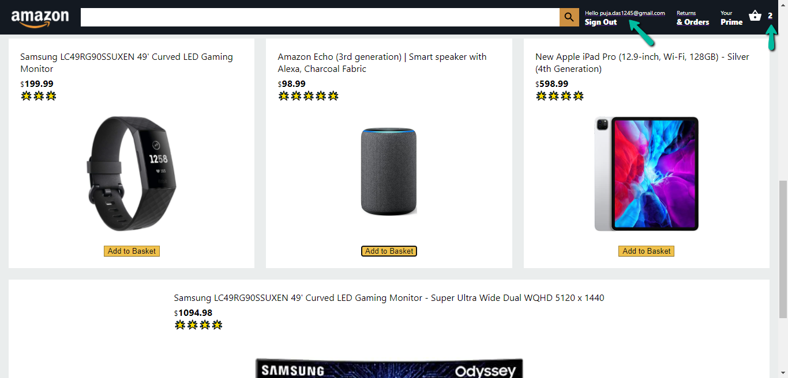

Fully Functional E-Commerce Website with Stripe Payment Gateway

## Languages Used:

I have built an amazone clone using React JS, Firebase, Stripe, Axios, Material UI, React Router DOM, React Context API

### Pages

This project includes the Home page, Auth page, Cart page, Orders page, Checkout page, and Payment page

### `Development Mode`
npm start
firebase emulators:start
Open [http://localhost:3000](http://localhost:3000) to view it in the browser.

### Image

## Home Page:

## Auth Page:

## Add to Cart & Hello User Functionalities:

## Checkout Page:

## Payment Page:

## Order Page:

### Deployment

As the firebase hoisting method is payable, i couldn't upload the whole project in firebase. But i implement all the functionalities in local.
Live Url- https://challenge-3865e.web.app/

###Live Process

<video width="320" height="240" controls>
  <source src="public/UI.mp4" type="video/mp4">
</video>
### Live Url

https://challenge-3865e.web.app/
